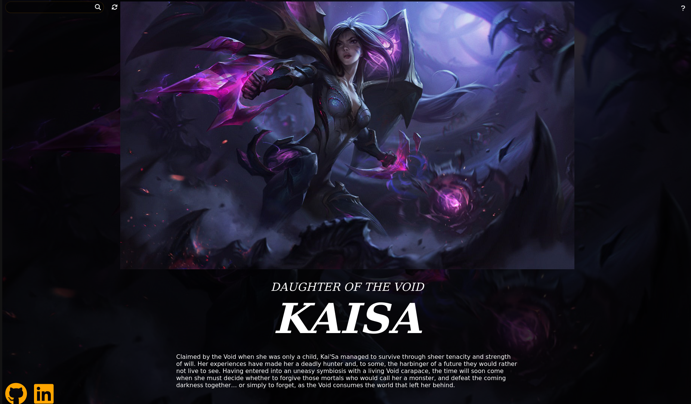
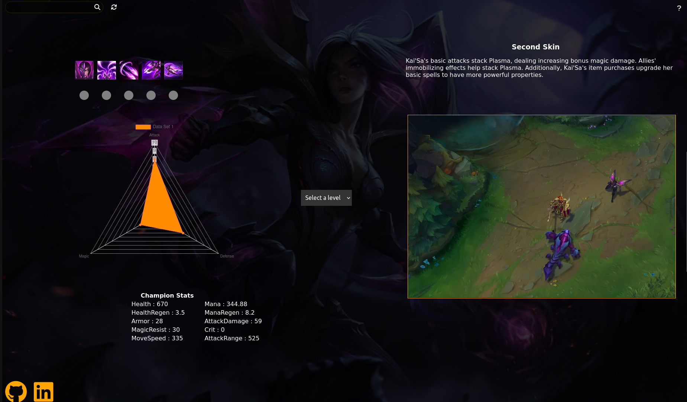
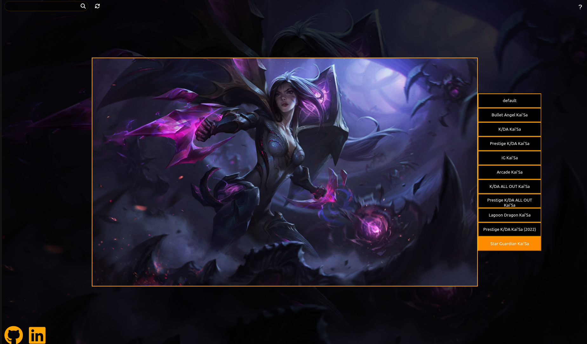

# Champion Analytics

Champion Analytics is a data visualization tool designed for the popular MOBA game, League of Legends. Utilizing data from Riot Games' ddragon API, it provides a comprehensive and insightful representation of champion statistics, lore, abilities, and descriptions.

## Getting Started
The application is hosted on https://junjiequ1459.github.io/Champion-Analytics/
A list of all current League of Legends champions can be found at https://leagueoflegends.fandom.com/wiki/List_of_champions

## Usage

interact with the visualizer by selecting a champion level between 1 and 18, resulting in real-time updates to the champion's statistics. Additionally, the visualizer offers video demonstrations of champion abilities, as well as a dedicated section displaying the champion's various skins. The search function allows for easy navigation and the ability to search for all currently available champions.

## Data Sources

The application uses data from the Riot Games ddragon API to provide accurate champion statistics and information.
https://ddragon.leagueoflegends.com/cdn/13.1.1/data/en_US/championFull.json

## Interactive Features

- Select a champion level between 1 and 18 to see real-time updates to statistics.
- Video demonstrations of champion abilities.
- View champion's various skins.

## Search Functionality

The search function allows for easy navigation and the ability to search for all currently available champions.(Case Sensitive)

## Mobile Optimization

The application is optimized for mobile devices and scales with display size.

## Contact Information

If you have any questions or issues, please email me at junjiequ123@gmail.com

## Screenshots

